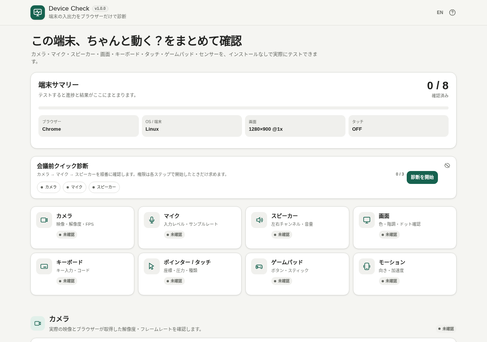

# Device Check

[](https://github.com/ttomohisa/htmlapps-device-check/actions/workflows/deploy-pages.yml)
[](LICENSE)
[](https://ttomohisa.github.io/htmlapps-device-check/)

[日本語版 README](README.ja.md)

A single-HTML browser utility for checking your camera, microphone, speakers, display, keyboard, pointer/touch input, gamepad, and motion sensors in one place.

## 🚀 Live demo

### [Open Device Check on GitHub Pages](https://ttomohisa.github.io/htmlapps-device-check/)

No installation or account is required. Open the app, choose a test, and interact with the device you want to check.

[](https://ttomohisa.github.io/htmlapps-device-check/)

## Features

- **Run a quick pre-call check** — Step through camera, microphone, and speaker checks before a meeting. Hide the guide when you do not need it; that display preference is remembered locally.
- **Inspect camera and microphone behavior** — Preview the selected camera and see reported resolution, FPS, facing mode, microphone level, waveform, peak, rolling noise floor, channel levels, and audio settings.
- **Test speakers by channel** — Play locally generated center, left, and right tones and record whether each output was audible.
- **Check display behavior full-screen** — Use solid colors, gradients, gray steps, checkerboards, 1 px lines, RGB ramps, image-retention patterns, and motion tests for visual inspection.
- **Check keyboard and touch input in real time** — See `key`, `code`, modifiers, simultaneous key presses, a visual key map, pointer coordinates, pressure, pointer type, and observed multi-touch count.
- **Inspect gamepads and motion sensors** — View buttons and axes live, try weak/strong haptics on supported controllers, and inspect orientation or motion values where available.
- **See browser capability support** — Review availability for related APIs such as WebGL, WebGPU, WebCodecs, MediaRecorder, Gamepad, and sensor APIs.
- **Use it on desktop or mobile** — Desktop keeps the full scrolling workspace; smartphones use a fixed four-tab bottom navigation that switches between Overview, Camera & Audio, Input, and Display & Device pages.

## Quick start

### Use the web demo

Just [open the demo](https://ttomohisa.github.io/htmlapps-device-check/) in a current browser.

Camera, microphone, fullscreen, and motion APIs may require HTTPS and explicit browser permission. The GitHub Pages build provides the secure context needed by most browsers.

### Use the standalone HTML

1. Download `dist/index.html` from this repository.
2. Open it in a current Chromium-based browser, Firefox, or Safari.
3. If a browser restricts a device API under `file://`, use the GitHub Pages version instead.

No Python, Node.js, or local web server is required to use the generated HTML.

## Usage

### Quick pre-call check

1. Start **Pre-call Quick Check**.
2. Check the camera preview and mark the camera step complete.
3. Start the microphone test, speak normally, and confirm that the level and waveform react.
4. Play the speaker test tones and confirm the outputs you can hear.
5. Finish the guide or switch back to any individual test at any time.

### Individual tests

The main screen provides dedicated tests for:

| Test | What you can check |
| --- | --- |
| Camera | Preview, selected device, resolution, FPS, facing mode |
| Microphone | Input level, waveform, peak, noise floor, left/right levels, sample rate, processing settings |
| Speakers | Center / left / right locally generated tones |
| Display | Solid colors, gradients, gray steps, checkerboard, fine lines, RGB ramps, retention pattern, motion |
| Keyboard | `key`, `code`, modifiers, visual key map, simultaneous-key count |
| Pointer / Touch | Mouse, pen, touch position, pressure, active pointers, observed multi-touch count |
| Gamepad | Buttons, axes, connected controller data, supported vibration tests |
| Motion | Device orientation and motion values when exposed by the browser |

The device summary at the top tracks which diagnostic sections have been checked during the current session.

### Display test notes

Display patterns are visual checks, not color calibration. Full-screen mode makes dead-pixel, banding, line, retention, and motion inspection easier, but the results still depend on the display, browser rendering, scaling, and your own visual judgment.

### Keyboard and multi-touch checks

For keyboards, hold multiple keys together to observe the maximum simultaneous keys detected by the browser. This can help expose ghosting or rollover limitations, but browser/OS behavior may affect the result.

Press Tab / Shift+Tab to leave the test area. **Clear keyboard results** removes only the keyboard history, current key, and unique / simultaneous-key counts, then marks the keyboard as Not checked. Other results and active tests stay as they are. Focus stays on the clear button; return to the test area to start a fresh check.

For touch screens, place multiple fingers on the test area at once. Device Check shows both the browser-reported `navigator.maxTouchPoints` value and the maximum number of simultaneous contacts actually observed during the session.

## Publish with GitHub Pages

The repository includes a workflow that builds the standalone HTML and deploys it to GitHub Pages automatically.

1. Push the repository to GitHub as `htmlapps-device-check`.
2. Open **Settings → Pages → Build and deployment → Source** and select **GitHub Actions**.
3. Push to `main`, or manually run the Pages deployment workflow from the Actions tab.
4. After a successful deployment, the app is available at `https://ttomohisa.github.io/htmlapps-device-check/`.

The generated deployment artifact is `dist/index.html`.

## Development and build layout

```text
.
├─ src/index.template.html        # Application source template
├─ assets/
│  ├─ favicon.svg                 # App icon asset
│  ├─ screenshot.png              # Desktop screenshot
│  └─ screenshot-mobile.png       # Mobile screenshot
├─ app.config.json                # App metadata
├─ dependencies.json              # Runtime dependency manifest
├─ build-standalone.bat           # Windows build entry point
├─ build-standalone.ps1           # Standalone HTML builder
├─ scripts/                       # Repository/build verification scripts
├─ dist/
│  ├─ index.html                  # Generated standalone app
│  └─ index.self-extract.html     # Gzip self-extracting distribution
└─ .github/workflows/
   ├─ build-standalone.yml        # Build validation
   └─ deploy-pages.yml            # GitHub Pages deployment
```

### Build locally on Windows

```bat
build-standalone.bat
```

Edit `src/index.template.html`; do not edit generated files in `dist/` directly.

The build also produces manifests and size reports used by the template verification workflow.

After intentional source edits, build with `./build-standalone.ps1`, copy `dist/index.html` to `device-check.html`, and run `./scripts/check-repository.ps1`. The check requires Node.js for synthetic media lifecycle, keyboard-result, and release-parity regressions; it rejects a stale root download. These tests use controlled promises, simulated media resources, and a synthetic DOM, never real devices or permissions.

## Runtime behavior

Camera and microphone access starts only after the corresponding test is started. When a previously selected input device can no longer satisfy the requested constraint, Device Check automatically retries with the browser's default device instead of stopping on an `OverconstrainedError`.

While a camera or microphone is starting, Start is disabled and Stop is available immediately. Changing the selected input replaces the pending or live attempt. Stop and leaving the page invalidate pending work; any late input is released. Stop may not dismiss the browser's permission prompt. A "Checked" result remains a session result after Stop; the hint states that capture has stopped.

If preview playback or microphone audio setup fails, resources are released and Start lets you retry. Web Audio support is checked before microphone permission is requested. If only the device list fails, the current input stays active and stoppable, with a retry hint.

The app does not need a backend for its diagnostics. The generated page includes a CSP with `connect-src 'none'`, and there are no analytics, remote fonts, CDN scripts, or runtime API calls. Only the language preference and quick-check visibility preference are stored locally; diagnostic values and mobile tab state are session-only.

## Limitations

- Browser APIs cannot directly diagnose an OS driver problem or confirm a physical hardware failure.
- Permission denial can make a working camera, microphone, or sensor appear unavailable.
- Some device APIs require HTTPS and may be unavailable when `dist/index.html` is opened directly with `file://`.
- Browsers cannot automatically determine whether a speaker tone was physically audible, so speaker results require user confirmation.
- Display tests are visual inspection tools and are not a substitute for a colorimeter or professional display calibration.
- Gamepad haptics vary by browser, controller, connection method, and operating system.
- Motion and orientation APIs are restricted or require an extra permission gesture on some mobile browsers.
- Keyboard ghosting and rollover results may be affected by browser and OS key handling.
- Network speed testing is intentionally not included.

## Dependencies

Device Check currently has **no third-party runtime library dependencies**. The diagnostic UI uses standard browser APIs and locally generated audio/visual test signals.

See [THIRD_PARTY_NOTICES.md](THIRD_PARTY_NOTICES.md) and [docs/DEPENDENCIES.md](docs/DEPENDENCIES.md) for repository dependency notes.

## Contributing

Bug reports and feature proposals are welcome through GitHub Issues. See [CONTRIBUTING.md](CONTRIBUTING.md) for development guidance.

## License

Copyright © 2026 ttomohisa

Licensed under the [MIT License](LICENSE).
